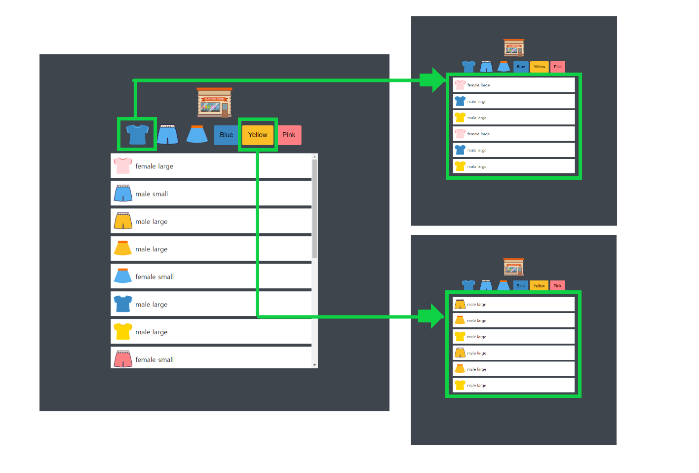

# mini-shopping

## 설명

유튜버 '[드림코딩 by 엘리](https://www.youtube.com/channel/UC_4u-bXaba7yrRz_6x6kb_w)' 님의 `Dream Coding`에 있는 쇼핑몰 미니게임을 `HTML`, `CSS`, `JavaScript`를 이용해 게임을 만들어 보는 프로젝트입니다.💻

---

## 과제

- 버튼에 `hover` 기능 추가
- `items scroll` 기능 추가
- `Java Script`로 `data` 동적으로 받아오기
- 버튼에 간단한 `filtering` 기능을 추가하여 `item`을 클릭하면 해당 `data` 가져와 보여주기

---

## 스택

HTML, Java Script, CSS

## 주요 기능

위의 그림과 같이 티셔츠를 클릭시 `main.js`를 실행시키고 `data.json`의 데이터에서 `type`의 값인 `tshirt`인 데이터들을 불러옵니다.

마찬가지로 Yellow버튼을 클릭하면 `main.js`로 실행시키고 `data.json`의 데이터에서 `type`의 값이 `yellow`인 데이터들을 불러옵니다.

불러온 데이터들 대한 값으로는 `type`, `gender`, `size`가 있습니다.

전체 상품을 보고싶다면 메인 페이지에 있느 `logo`를 클릭하면 모든 데이터들이 보여집니다.
